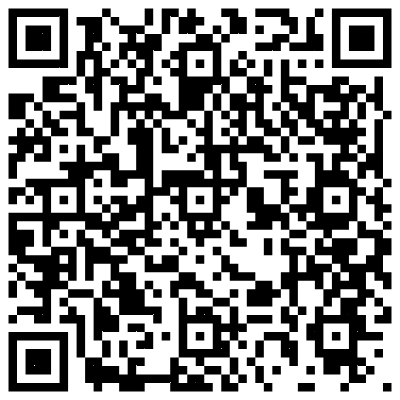

# Lecture: General Physics II
* Time: (2024 February 18 - June 15) 234節, Wednesday
* Lecturer: [Hauyu Baobab Liu](https://baobabyoo.github.io/) (呂浩宇)
* Location: NSYSU, 化學系機電系中文班 (工EN 4055-1) / 生科系全英班 (理SC 0008)
* Language: 中文/全英

### TA
- TBA

### Office Hours (理SC2006-3)
- Location: **理SC2006-3**
- Time periods: Tue. 16:00-18:00; Thur. 16:00-18:00
- 確診感冒、流感、covid，或有其它口鼻症狀或傳染病者嚴禁進入我辦公室

### Homework and Suggested Problem Sets:
#### Homework (format: hand-writing on A4 papers; on due date, hand it to the TA)
- None

#### Suggestion
-
- Halliday & Resnick's Principles of Physics (11th ed.), chapter 37, Problems 1, 6, 7, 13, 21, 32, 37, 38, 39, 55
- Halliday & Resnick's Principles of Physics (11th ed.), chapter 38, Problems 1, 2, 5, 9, 11, 13, 23, 56
- Halliday & Resnick's Principles of Physics (11th ed.), chapter 39, Problems 2, 3, 4, 7, 9, 12, 22, 25, 32, 35, 54, 55
- Halliday & Resnick's Principles of Physics (11th ed.), chapter 40, Problems 17, 54, 57

- Halliday & Resnick's Principles of Physics (11th ed.), chapter 21, Problems 24, 30, 35
- Halliday & Resnick's Principles of Physics (11th ed.), chapter 22, Problems 5, 10, 16, 45, 46, 58, 59
- Halliday & Resnick's Principles of Physics (11th ed.), chapter 23, Problems 1, 3, 4, 10, 11, 12, 13, 16, 27, 28, 36, 59
- Halliday & Resnick's Principles of Physics (11th ed.), chapter 24, Problems 4, 31, 42, 59, 61

## Syllabus:
1. (February 21) 狹義相對論 special relativity [PDF notes](https://github.com/baobabyoo/Lecture_GeneralPhysics_2023Feb/blob/master/lecture_notes/SpecialRelativity_part1.pdf)
2. (February 28) 國定假日
3. (March 06) 狹義相對論現象 special relativity related phenomena [PDF notes](https://github.com/baobabyoo/Lecture_GeneralPhysics_2023Feb/blob/master/lecture_notes/SpecialRelativity_part2.pdf)
4. (March 13) 運動會放假
5. (March 20) 量子物理概念 general concept of quantum physics [PDF notes](https://github.com/baobabyoo/Lecture_GeneralPhysics_2023Feb/blob/master/lecture_notes/QuantumPhysics_part1.pdf)
6. (March 27) 自由電子波函數, 位能井 wave function of free electron, potential well
7. (April 03) 氫原子模型, 元素週期表 periodic table [PDF notes](https://github.com/baobabyoo/Lecture_GeneralPhysics_2023Feb/blob/master/lecture_notes/QuantumPhysics_part2.pdf)
8. (April 10) 固態物理簡介 introduction to solid state physics [PDF notes](https://github.com/baobabyoo/Lecture_GeneralPhysics_2023Feb/blob/master/lecture_notes/QuantumPhysics_part3.pdf) In addition, I came across [this webpage](https://www.pveducation.org/pvcdrom/pn-junctions/bias-of-pn-junctions) which gives a very nice introduction about the pn junctions.
9. (April 17) 中文班期中考(筆試); 全英班彈性學習
10. (April 24) 靜電靜磁學 electric field/force, magnetic field/force [PDF notes](https://github.com/baobabyoo/Lecture_GeneralPhysics_2023Feb/blob/master/lecture_notes/Electromagnetic_part1.pdf)
11. (May 01) 電生磁、磁生電 law of induction [PDF notes](https://github.com/baobabyoo/Lecture_GeneralPhysics_2023Feb/blob/master/lecture_notes/Electromagnetic_part2.pdf)
12. (May 08) 基礎電路學 basic circuits [PDF notes](https://github.com/baobabyoo/Lecture_GeneralPhysics_2023Feb/blob/master/lecture_notes/Electromagnetic_part3.pdf)
13. (May 17) 馬克士威方程、電磁波 Maxwell's equation, electromagnetic wave [PDF notes](https://github.com/baobabyoo/Lecture_GeneralPhysics_2023Feb/blob/master/lecture_notes/Electromagnetic_part4.pdf)
14. (May 22) 物理光學 physical optics [PDF notes](https://github.com/baobabyoo/Lecture_GeneralPhysics_2023Feb/blob/master/lecture_notes/Optics_part1.pdf)
15. (May 29) 幾何光學 geometric optics [PDF notes](https://github.com/baobabyoo/Lecture_GeneralPhysics_2023Feb/blob/master/lecture_notes/Optics_part2.pdf)
16. (June 05) 中文班期末考(筆試); 全英班期末口試
17. (June 12) 原子核物理簡介 introduction to nuclear physics [PDF notes](https://github.com/baobabyoo/Lecture_GeneralPhysics_2023Feb/blob/master/lecture_notes/NuclearParticlePhysics.pdf)
18. (June 19) 彈性學習

## Goal:
1. Knowing modern physics, in particular, quantum physics.
2. Knowing the theory of atoms and how to build periodic table.
3. Broadly knowing the physical physical phenomena.

## Expectation:
1. This is a 3-credits' course. The expected weekly workload for you is 3 hours on average if you have no experience and knowledge in this area.

## Assessment:
- homework: 0%
- mid-term exam: 中文班 50% / 全英班 0%
- final exam: 中文班 50% / 全英班 100%

## Suggested Textbooks:
1. Jearl Walker, David Halliday, Robert Resnick, Principles of Physics 11th or 12th Edition.

## 口試規定: TBA
